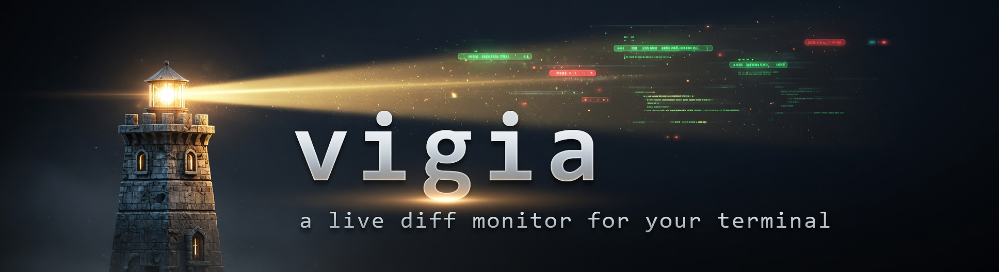
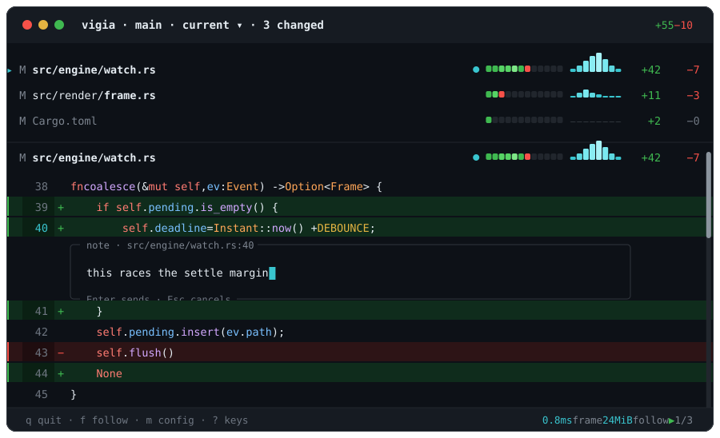

<div align="center">



### A live diff **monitor** for your terminal.

*Portuguese: a watchman, the one who keeps watch. At sea, also a porthole.*

[](https://crates.io/crates/vigia)
[](https://crates.io/crates/vigia)
[](https://github.com/breferrari/vigia/actions/workflows/ci.yml)
[](LICENSE)
[](https://www.rust-lang.org)

**Your agent writes in one pane. `vigia` watches in the pane beside it.**

</div>



---

## 🔭 Why

An agent edits **fast**, **wide**, and while you are reading something else. The scrollback tells you what it *said* it did. `vigia` shows you what actually landed, continuously, without being touched.

|  |  |
|---|---|
| 🤖 **Built for the pane beside the agent** | Zero input required. It follows the newest change and scrolls to it on its own |
| 🪶 **Cheap enough to leave open for a week** | Zero wakeups while idle, under 5% memory drift over 24 hours |
| 🎯 **The diff, and nothing else** | No branches, no commits, no stash list, no staging, no modes |
| 📐 **Fits half a laptop screen** | Legible at 40 columns, because that is the actual pane you have |

> [!NOTE]
> **A monitor, not a reviewer.** A reviewer is something you *launch* per changeset to step through, annotate and decide on. `vigia` is already open. It is closer to `btop` than to a git client: you read it from shape and colour, then glance away.

---

## 📦 Install

```sh
cargo install vigia                          # any platform with a Rust toolchain
brew install breferrari/tap/vigia            # macOS and Linuxbrew
```

Or grab a prebuilt binary, no toolchain at all:

```sh
# macOS and Linux
curl --proto '=https' --tlsv1.2 -LsSf https://github.com/breferrari/vigia/releases/latest/download/vigia-installer.sh | sh

# Windows
powershell -ExecutionPolicy Bypass -c "irm https://github.com/breferrari/vigia/releases/latest/download/vigia-installer.ps1 | iex"
```

Then, from the tree you want to watch:

```sh
vigia                    # this directory
vigia ~/code/some-repo
vigia --version          # or -V. It is the only option there is
```

<details>
<summary><b>Targets, static linking and the no-C-toolchain rule</b></summary>

<br>

Every [release](https://github.com/breferrari/vigia/releases) carries archives directly, for x86-64 Linux, Intel and Apple-silicon macOS, and x86-64 Windows. The Linux build is statically linked against musl, so it runs on any distribution without matching a system libc.

From source needs Rust 1.85 or newer:

```sh
cargo install --git https://github.com/breferrari/vigia vigia
```

**No C toolchain, on any of those paths.** Every dependency is pure Rust, and CI asserts it on each shipped target rather than claiming it: a `cc`, `cmake` or `bindgen` entering the dependency graph fails the build.

</details>

---

## 👀 Reading the pane

```
   header  │  my-repo · 3 changed                                     watching
           │
 masthead  │           ▂▃▅▇▅▃▂                       ← press m for this
      (m)  │      ▁▂▃▅███████████▅▃▂▁
           │
     list  │  ▸ M src/engine/watch.rs   ●  ■■■■■■■■■■■■  __▁▂▆█__   +42    -7
           │    M src/render/frame.rs      ■■■■■■■■■■■■  ________   +11    -3
           │    M Cargo.toml               ■■■■■■■■■■■■  ________    +2    -0
     rule  │  ───────────────────────────────────────────────────────────────
     diff  │    M src/engine/watch.rs   ●  ■■■■■■■■■■■■  __▁▂▆█__   +42    -7
           │    @@ -38,7 +38,9 @@
           │    38    fn coalesce(&mut self, ev: Event) -> Option<Frame> {
           │    39 +      if self.pending.is_empty() {
           │    40 +          self.deadline = Instant::now() + DEBOUNCE;
     rule  │  ──────────────────────────────────────────────────────────────
   status  │  q quit · f follow · ? keys   3.1ms frame   25MiB  follow ▶  1/3
```

The list is **pinned**, so the signals stay on screen while you read the diff under them. Every file gets the same row in both regions:

| | | Answers |
|---|---|---|
| `▸` | **caret** | 📍 *where you are.* The diff below is inside this file |
| `M` | **kind** | modified, added, deleted, renamed |
| `src/…` | **path** | which file. How brightly it is drawn is how recently it changed |
| `●` | **pulse** | ⚡ it changed on the newest tick |
| `■■■■` | **heat strip** | 🗺️ **where** in the file the change is |
| `__▁▂▆█` | **sparkline** | ⏱️ **when** it changed, over the last two minutes |
| `+42 -7` | **counters** | 📊 **how much**, in lines |

They exist separately because a glance can only ask one question. You read the one you came for and ignore the rest.

<details>
<summary><b>🗺️ The heat strip is <i>where</i></b></summary>

<br>

Cut the file into equal slices, top to bottom, twelve of them on an ordinary pane and twenty-four on one wide enough to spare the columns, and colour each one by what happened inside it: **green** for lines added, **red** for removed, and a third colour where both. It is a map of the file you are *not* looking at, so a strip lit only at its right end says the change is at the bottom and you have not scrolled there yet. Brighter means more lines in that slice.

A slice nothing touched is still drawn, in a dark track colour, because a strip with holes in it would be a different shape per file and you could not compare two at a glance. On a narrow pane adjacent slices are summed and reclassified rather than dropped, so it stays a whole file at every width.

</details>

<details>
<summary><b>⏱️ The sparkline is <i>when</i></b></summary>

<br>

Twelve columns across the last two minutes, so each column is ten seconds, oldest on the left. A taller column is more bytes moving around that ten seconds. Every column always covers the whole two minutes between them: a narrow pane draws six columns of twenty seconds rather than the last minute, and a pane wide enough to spare the room draws twenty-four of five.

**Around, rather than in.** A save is a point event, so the raw samples are zero almost everywhere and drawing them gives you a spike train on a flat line rather than a graph. What the column draws is a **level**: the bytes near it, weighted by a six-second kernel that looks both ways, which is what reading a series of point events as a density means. The mockup drew these as waves before the first commit, and drawing the events raw was the defect.

It is scaled **across every tracked file**, not against the row's own maximum, and that is the whole point: a row scaled to itself would draw full height the moment it was the busiest thing *it* had ever been, and you could not tell the file an agent is hammering from the file it touched once. A column with no writes draws a flat track `_` rather than nothing, for the same reason the heat strip draws its empty slices.

</details>

<details>
<summary><b>⚡ The pulse, the caret, and what is <i>not</i> a selection</b></summary>

<br>

The dot marks the file named by the newest tick, and it lasts exactly one tick, so it **cuts rather than fades**. The path's own brightness is the same signal, slower: the file that just changed, one that changed recently, and one that has not, are three intensities of the same colour.

The caret `▸` is a different claim, and the only one about you: the diff below is inside this file. It is a marker, not a cursor. **Nothing on this pane is ever selected**: not the caret, not the row under your pointer. Nothing is remembered when you move away, no row becomes special, and the next key means exactly what it would have meant.

The counters lend colour only where it says something: a `-0` stays grey, because a zero is not reporting a removal.

</details>

### 🖍️ The diff itself is highlighted, in every language you write

**217 grammars**, so the languages a 2026 tree is actually made of are coloured rather than plain: TypeScript and TSX, Swift, Kotlin, Dart, Elixir, Julia, Zig, Nim, Crystal, F#, Solidity, Gleam, V, Odin, Elm, PowerShell, SCSS and Sass and Less, Vue and Svelte, TOML, Protobuf, GraphQL, Terraform, Dockerfile, CMake, Nix, and `go.mod` and `.gitignore` and `.env`, beside the C-family and scripting languages you would expect.

<details>
<summary><b>🖍️ How a file finds its language, and the four it cannot</b></summary>

<br>

The grammars are `bat`'s curated collection, which is the same set that tool highlights with, compiled into one dump the binary carries. Every one of their licences is reproduced in `NOTICE.md`, which ships in the release archives and in the published crate rather than only living here.

**Five steps decide the language**, in order, because an extension alone gets a surprising number of files wrong:

1. **A written rule**, where one extension has more than one honest answer. `.h` is Objective-C, whose grammar is a superset of C, so C headers colour fully and only C++-only constructs go plain. `.m` is Objective-C over MATLAB, `.v` is V over Verilog, `.jsx` borrows the TSX grammar, and `.sass` is Sass, which it was not: it used to resolve to Ruby Haml, which is a confidently wrong colour rather than a missing one.
2. **The whole file name**, so `Dockerfile`, `CMakeLists.txt` and `go.mod` are found by name. This runs *before* the extension, which is what fixes `CMakeLists.txt`: the CMake grammar registers it whole, and looking up `txt` first handed it to plain text.
3. **The extension**, with a leading-dot retry so `.gitignore` finds a grammar registered as `gitignore`.
4. **The nearest grammar**, for the four formats below.
5. **The first line**, which is how an extensionless script with a `#!` gets a language at all, and how a `.ts` file that is really a Qt translation file gets read as the XML it is instead of as TypeScript.

**Four formats have no grammar this stack can carry**, and they draw as their nearest relative rather than as nothing: `.astro` as HTML and `.bicep` as JavaScript, because both upstreams are written in a Sublime Text 4 dialect `syntect` does not implement and both extend exactly those; `.mdx` as Markdown and `.mojo` as Python, which they are supersets of. Carbon has no grammar anywhere in this format, so it draws plain. That step runs *after* the four above, so the day a real grammar lands it wins without anything being deleted.

A file type nothing recognises is not an error. It draws exactly as it did before there was highlighting at all, because a monitor that refused a file it could not colour would have inverted its own job.

</details>

### 📈 And the masthead, which is the whole tree

Every signal above is about **one file**. Press `m` and the **masthead** opens under the header: the same two-minute window, summed across **every** file at once.

Two names for one thing, and both are used: **masthead** is the block at the top of the page, in the newspaper sense, and **churn band** is the graph drawn in it.

```
                 ▂▃▅▇▅▃▂
            ▁▂▃▅███████████▅▃▂▁
   └─────────────────────────────────┘
   two minutes ago                 now
```

Two rows, stacked, growing upward from a drawn baseline, and the same level the sparklines draw. A quiet stretch is a floor rather than a gap, which is what makes a burst read as a spike on a graph instead of a block floating in the dark. That resolution is the point: it answers a question no file row can, which is *is anything happening at all right now, and was it busier a minute ago.* A tall block that has been collapsing for thirty seconds is an agent that has finished.

It is drawn the way a system monitor draws one. Three things come with that: one value per sub-column, so where your font carries braille the band resolves twice the detail it does in blocks; the axis, so a lone spike stands on something; and a scale set above the ordinary write rather than at the window's peak, because one `cargo build` rewriting a lock file is two orders of magnitude above an ordinary save, and against *that* denominator every edit for the next two minutes draws one level high.

It starts **hidden**, because it costs three rows of diff and is not wanted on every pane. Press `m` again and the rows go straight back to the diff.

<details>
<summary>Why three rows and not four</summary>

<br>

The blank above the band is the row the header keeps between itself and the list whether the band is drawn or not. So turning the band on takes the two rows of graph and the one blank under it, and nothing else on the pane moves.

</details>

---

## ⌨️ Drive it

<table>
<tr><td valign="top" width="50%">

**Keys**

| | |
|---|---|
| `q` `Esc` `Ctrl+C` | quit |
| `j` `k` `↑` `↓` | scroll a row |
| `Space` `PgDn` `PgUp` | page |
| `d` `u` | half a page |
| `g` `G` | first / last file |
| `n` `p` | next / previous file |
| `1` to `6` | jump to that list row |
| `J` `K` | scroll the pinned list |
| `f` | follow the newest change, or stop |
| `m` | show or hide the masthead |
| `?` | **all of this, on screen** |

</td><td valign="top" width="50%">

**Mouse**

| | |
|---|---|
| wheel | scroll what you point at |
| drag a bar | move that region |
| click a track | send it there |
| click `▲` `▼` | one row, repeats held |
| click a file | jump the diff to it |
| just point | it marks itself |

</td></tr>
</table>

> [!TIP]
> Press `?` and you never have to remember any of it. The sheet draws over rows that are already there, so **nothing moves** when it opens or closes, and every key still means what it meant.

<details>
<summary><b>The small print on the keys</b></summary>

<br>

`Ctrl+D` quits too, and `Home` / `End` are aliases for `g` / `G`, `Shift+↑` / `Shift+↓` for `J` / `K`.

The digits count **rows on screen**, not files in the repository: `3` is the third row the list is drawing, so it means a different file once you have scrolled the list with `J`. A digit naming a row that is not drawn does nothing at all, and neither does `n` at the last changed file or `p` at the first.

It shows the working tree against the **index**, untracked files included, and it follows whatever changed last until you scroll away. With nothing to show it says so, and names the branch it found nothing on.

</details>

---

## ⚡ Promises

Budgets, not hopes. Each one has a test that fails when it is missed, and a regression past any of them **fails the build**.

| | | |
|---|---|---|
| 🔔 | **Event driven** | Zero wakeups while idle. No filesystem event, no work. Never a polling timer |
| 🚀 | **Instant start** | Under 50ms to first paint |
| 🌊 | **Streaming** | First paint under 100ms, even on a 100,000 line diff |
| 🎞️ | **60fps** | Frame time under 16ms at p99, *while files are being written* |
| ♻️ | **Incremental diff** | Re-diff cost scales with what changed, not with your worktree |
| 🖍️ | **Incremental highlight** | Re-parse cost scales with your edit, not the file |
| 🪶 | **Flat over days** | Under 5% memory drift across 24 hours. No retained temp files |
| 🧘 | **Correct untouched** | Follows the newest change and scrolls to it with no input |
| 📐 | **Narrow panes** | Legible at 40 columns |
| 🚪 | **Clean exit** | Terminal restored on every exit it can observe: the quit key, `Ctrl+C`, an error, a panic, or the first kill from outside |

<details>
<summary><b>The numbers behind them</b></summary>

<br>

The scrollbar beside the diff is **row-exact**: it spans the screen's rows over the diff's total rows and sits at the rows above it. Counting every changed file's height turned out to cost **8.76ms** where materialising the same diffs costs **442.71ms**, so the bar says where the end is rather than approximating it.

That count is incremental too: a file that has not changed since the last tick is proved unchanged by a `stat` rather than read again, which is **1.29ms against 12.90ms** over a hundred files.

The frame time in the status bar is a promise rather than a diagnostic: it is the p99 of the last 128 frames, against the 16ms this is gated at. The memory beside it is read once a frame and costs about **240ns**, a syscall against a 16ms budget.

</details>

---

## 🎨 Make it yours

Three independent settings, and most confusion here is any two being read as one. A **palette** is which colours `vigia` means. A **depth** is how many your terminal can show. **Glyphs** is which drawing characters its font carries. All three have to allow a thing before it appears.

| | First answer wins |
|---|---|
| 🎨 **Palette** | `VIGIA_THEME` (a name, or a path) → `~/.config/vigia/theme` → `ansi` |
| 🔦 **Depth** | `VIGIA_COLOR` → `NO_COLOR` → `TERM=dumb` → `COLORTERM` → `TERM_PROGRAM` → `TERM` → 16 |
| ✏️ **Glyphs** | `VIGIA_GLYPHS` → `TERM=dumb`/`linux` → `TERM_PROGRAM` → `WT_SESSION` → `TERM` → braille, or blocks on a bare Windows console |

```sh
VIGIA_THEME=ansi     # default: the sixteen names, inherited from your scheme
VIGIA_THEME=dark     # the picture above, in 24-bit colour
VIGIA_THEME=light    # the same design for a light terminal
VIGIA_THEME=~/themes/mine
```

Nothing else is read. There is no flag for any of them, and no setting in one can change another.

A theme file is usually about three lines. `base` picks a palette to start from and every line after it overrides one thing, so this keeps your terminal's own sixteen colours and adds the two backgrounds `ansi` declines to guess:

```ini
base        = ansi
added_row   = on #1b3d29
removed_row = on #45222a
```

<details>
<summary><b>🎨 The full theme format</b></summary>

<br>

`~/.config/vigia/theme` is read when it exists, on every platform, resolved from `HOME` or `USERPROFILE`. No file is the ordinary case and is not an error. A file that exists and does **not parse** is: `vigia` says which line and exits *before* it takes the screen, because an error painted inside a full-screen program that then hands the terminal back is an error nobody reads.

A key it does not recognise is an error naming the line, never a line quietly ignored.

A value is `[colour] [on colour] [modifiers]`:

| Part | Written as |
|---|---|
| Colour | `#rrggbb`, a palette index `0` to `255`, one of the sixteen names, or `default` |
| Names | `black` `red` `green` `yellow` `blue` `magenta` `cyan` `grey` `white`, each with a `bright-` twin |
| Background | `on` followed by a colour |
| Modifiers | `bold` `dim` `italic` `underline` `reverse`, any number |

Every key the shell draws with:

| Group | Keys |
|---|---|
| Chrome | `chrome` `chrome_dim` |
| Scrollbars | `bar` `bar_track` `bar_active` `bar_hover` |
| File rows | `path` `path_live` `path_cold` `path_hover` `pulse` `kind` |
| Sparkline | `spark` `spark_warm` `spark_hot` `spark_track` |
| Heat strip | `heat_track`, and `heat_added` `heat_removed` `heat_mixed` each with a `_warm` and `_hot` twin |
| Diff | `hunk` `gutter` `added` `removed` `context` `note` `alert` |
| Row wash | `added_row` `removed_row` `added_bar` `removed_bar` |
| Syntax | `keyword` `type_name` `function` `variable` `constant` `string` `number` `comment` |

The `_warm` and `_hot` twins are the intensity rungs: a sparkline column and a heat slice both ramp through three levels, so the two glance elements on one row read through one mechanism. `bar_active` is a bar being dragged, `bar_hover` and `path_hover` are the marks under the pointer.

**`ansi` is the default and draws no row wash at any depth**, deliberately. A wash has to assume a background and that palette assumes none: every colour in it is a *name*, so it resolves to whatever your terminal scheme says and `vigia` matches the pane beside it instead of arguing with it. The cost is the wash, which is why the three-line file above exists: keep `ansi` for the sixteen names your scheme already defines, and add the two backgrounds it declines to guess. Pick your own if your pane is lighter or darker. The only rule is that they stay far enough from your background to read as bands, and far enough from each other that an addition never looks like a removal.

</details>

<details>
<summary><b>✏️ Sparkline glyphs, and what to do if you see boxes</b></summary>

<br>

The per-file sparkline draws from the eighth-blocks `▁▂▃▄▅▆▇█` by default on terminals whose font may not carry anything denser, and from **braille** where it can. Braille packs two buckets into one cell, so the usual twelve-column strip fits six columns instead of twelve, and it survives on a narrower pane instead of halving and then disappearing.

**Nothing can ask a terminal which glyphs its font has.** There is no escape sequence for it, so this is decided the same way the colour depth is: from what the terminal calls itself. If the guess is wrong in either direction, say so:

```sh
VIGIA_GLYPHS=braille         # denser: 8 buckets in 4 columns
VIGIA_GLYPHS=block           # the safe floor, if you see boxes
VIGIA_GLYPHS=octant          # Unicode 16 solid 2x4, very few fonts have these yet
VIGIA_GLYPHS=auto            # decide for me, which is the default
```

**If the sparkline is a row of boxes, you want `block`.** That is a font without the braille patterns U+2800 to U+28FF, and it is the one direction detection cannot see. Windows is where this is most likely: the old console draws with Consolas, which carries none of them, so a bare `conhost` gets blocks and Windows Terminal gets braille.

`octant` is deliberately never chosen for you. The Unicode 16 octants are newer than most fonts, including the current Cascadia, and terminals that draw them do so themselves rather than from your font, which nothing in the environment advertises.

</details>

<details>
<summary><b>🔦 Colour depth, and why your rows might be unwashed</b></summary>

<br>

`VIGIA_COLOR` overrides detection with `never`, `16`, `256`, `truecolor` or `auto`, and `NO_COLOR` is honoured.

**The row wash needs 24-bit colour.** It is dropped at every rung below rather than approximated, because a quantised background is a solid block, and a block behind highlighted code destroys the colours on it. The 256-colour cube is the case worth naming: its two darkest levels per channel are 0 and 95, so `#1b3d29` lands on `#005f00`, and a newly added file draws as a screen of flat green rather than a tint. Below 24-bit the diff signal is the `+` and `−` column, which is where it was before themes existed.

If your rows are unwashed and you know your terminal draws 24-bit, it is nearly always detection: `COLORTERM` is the only convention for claiming it and **nothing propagates it**. `ssh` forwards `TERM` and not `COLORTERM`, and a multiplexer replaces `TERM` with an entry of its own.

```sh
VIGIA_COLOR=truecolor        # settles it, in the pane or in your rc
```

Inside `tmux` that is only half of it, because `tmux` has to pass 24-bit through rather than round it to its own palette:

```sh
# ~/.tmux.conf
set -g  default-terminal "tmux-256color"
set -ga terminal-overrides ",*:Tc"
```

</details>

---

## 🧱 Built with

| | |
|---|---|
| [ratatui](https://github.com/ratatui/ratatui) + [crossterm](https://github.com/crossterm-rs/crossterm) | The TUI. `crossterm` for cross-platform mouse and Windows |
| [gix](https://github.com/GitoxideLabs/gitoxide) | Pure Rust git. Diffs in process, no subprocess per change |
| [notify](https://github.com/notify-rs/notify) | Native filesystem events, which is what "no polling timer" requires |
| [syntect](https://github.com/trishume/syntect) | Syntax highlighting, pure Rust, so no C toolchain in CI |
| [two-face](https://codeberg.org/CosmicHarper/two-face) | The grammars: [bat](https://github.com/sharkdp/bat)'s curated set, packaged for `syntect`. It builds the dump the binary carries and is itself absent from every shipped graph |

Everything is pure Rust on purpose: a genuinely static Linux binary needs no cross toolchain, and macOS and Windows are plain tier-1 targets.

## 🗺️ Status

`🚧` **Early, and released.** The install lines above are live. The surface is one optional path and `--version`, on purpose, and look and feel is where the work is.

| | Phase | |
|---|---|---|
| ✅ | **1. Core engine** | Watch, coalesce, diff, incremental re-diff. No UI |
| ✅ | **2. Minimum monitor** | The TUI: follow mode, scroll, mouse, layout, clean exit |
| ✅ | **3. Glanceability** | Sparklines, heat bars, live counters, the status bar, theming |
| ✅ | **4. The artifacts tell the truth** | README, mockup, spec and tracker agree with each other |
| ✅ | **6. Measured, not assumed** | Claims that outran their evidence get the measurement that settles them |
| ✅ | **7. Distribution** | crates.io, Homebrew tap, prebuilt binaries |
| 🔨 | **8. Look and feel** | Layout, colour, keys, chrome: the polish a first user actually sees |

There is no Phase 5 in that table: the shelf, where deferred work waits with the dated reason it was deferred for, was numbered as one until August and kept its milestone.

Built in the open, spec first. [`SPEC.md`](SPEC.md) is the source of truth and is written *before* the code, so it is the honest place to see where this is going and to argue with it. [`ROADMAP.md`](ROADMAP.md) is the live state, issue linked.

<details>
<summary><b>🖼️ About that picture at the top</b></summary>

<br>

**It is a mockup, not a screenshot**, and `VIGIA_THEME=dark` is what draws it. All of it draws today: the header, the blank row under it, the pinned list, the counters in green and red, the sparklines, the heat bars, the caret and the bold path that goes with it, the pulse, the scrollbar with its step buttons, the tinted rows and their left bars, the highlighted diff, and the status bar.

**The picture is a specification here, not decoration.** `SPEC.md` §5.1 rules that where the mockup answers a question the spec left open, the mockup *is* the answer, so every disagreement between it and the binary is either a bug or a departure somebody wrote down. **One is left**: the header reads the worktree's name rather than `vigia`, because a title bar spends six of forty columns telling you which program you started, and what you cannot tell by looking is which tree.

Everything else that disagreed was the picture being behind, and it has been brought forward: the status bar's hints, the position beside the follow marker, the branch, the caret standing on the pane's own edge, the diff's heading drawing the same row as the list above it, and the row's right-hand order, which now places the pulse, heat strip, sparkline and counters where the binary places them.

</details>

## 🏷️ The name

*Vigia* is Portuguese: a watchman, a lookout, the one who keeps watch. At sea it also means a porthole, the small round window you look through.

Both readings are the tool. It watches, and it is the window you watch through.

It is also the verb, third person. So `vigia .` reads as a sentence.

---

<div align="center">

**MIT** · Built in the open · [SPEC](SPEC.md) · [ROADMAP](ROADMAP.md) · [Issues](https://github.com/breferrari/vigia/issues)

</div>
